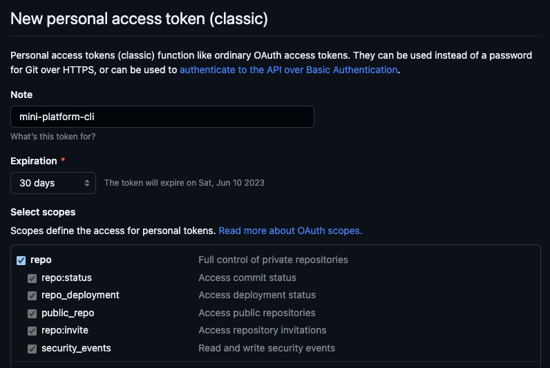

# Introduction

## Creating Github Organization

We will use an Org to simulate a real world (or aproximatelly one). 

You can see how to [create a new organization on Github here](https://docs.github.com/en/organizations/collaborating-with-groups-in-organizations/creating-a-new-organization-from-scratch)

## Using go-github
In this [page](../creating-minictl/index.md) I created the command `minictl create application --name` and now I will use the [go-github]("github.com/google/go-github") project to create our repository.

## Personal Access Token

To get access to Github, was necessary to create a Personal Access Token on Github. To get the Personal Access Token, you need to follow this [official Github tutorial](https://docs.github.com/en/enterprise-server@3.4/authentication/keeping-your-account-and-data-secure/creating-a-personal-access-token).

Is necessary to select those scopes to get access to create an repository:



## Code to create the repo

I created a minimal code to create the repository, is required to configure two environment variables, the first one is `MINI_PLATFORM_ORG` and the second one is `MINI_PLATFORM_GH_TOKEN`.

- `MINI_PLATFORM_ORG` is the organization's name.
- `MINI_PLATFORM_GH_TOKEN` is your Personal Access Token.


```go
package repo

import (
	"context"
	"fmt"
	"github.com/google/go-github/v52/github"
	"golang.org/x/oauth2"
	"log"
	"os"
)

type Repo interface {
	Create(name string)
}

type repo struct {
	Client *github.Client
}

func (r *repo) Create(name string) {
	ctx := context.Background()
	org := os.Getenv("MINI_PLATFORM_ORG")
	repository, response, err := r.Client.Repositories.Create(ctx, org, &github.Repository{
		Name: &name,
	})

	if err != nil {
		log.Fatalln("error while creating repository", err.Error())
	}

	if response.StatusCode == 201 {
		log.Println(fmt.Sprintf(`
Hey! Your repository is ready
Get the repository: git clone %s`, *repository.CloneURL))
	} else {
		log.Fatalln("Sorry! was not to possible creating your repository")
	}
}

func NewRepo() Repo {
	personalAccessToken := os.Getenv("MINI_PLATFORM_GH_TOKEN")
	ctx := context.Background()
	ts := oauth2.StaticTokenSource(
		&oauth2.Token{AccessToken: personalAccessToken})
	tc := oauth2.NewClient(ctx, ts)
	client := github.NewClient(tc)
	return &repo{
		Client: client,
	}
}
```

After this implementation, was necessary to execute it when `minictl create application --name` is called:

```go
func NewCreateApplicationCommand() *cobra.Command {
	var createApplicationCmd = &cobra.Command{
		Use: "application",
		Run: func(cmd *cobra.Command, args []string) {
			log.Println(fmt.Sprintf("Creating application with name '%s'", applicationName))
			newRepo := repo.NewRepo()
			newRepo.Create(applicationName)
		},
	}

	createApplicationCmd.PersistentFlags().StringVar(&applicationName, "name", "", "--name=application-name")
	_ = createApplicationCmd.MarkPersistentFlagRequired("name")

	return createApplicationCmd
}
```

## Using the minictl

It will be a step-by-step to create a repository with `minictl`.

1. Clone the repository:

```sh
    git clone https://github.com/mcruzdev/minictl`
```

2. Build the CLI:

```sh
    cd minictl && go build -o=minictl .
```

3. Set all required variables `MINI_PLATFORM_ORG` and `MINI_PLATFORM_GH_TOKEN` and execute the CLI:

```sh
    ./minictl create application --name=mini-platform-api
```

The output shoul looks like it:

```
2023/05/13 11:05:21 Creating application with name 'team-api'
2023/05/13 11:05:22 
Hey! Your repository is ready
Get the repository: git clone https://github.com/mini-platform/team-api.git
```

There is no validation yet, but if you create a valid repository name, it works well!

## Contribute

If you want to collabare with me, create an issue and open a pull request [here](https://github.com/mcruzdev/minictl). The commit related with this page is [here](https://github.com/mcruzdev/minictl/commit/5c7cb5a4e6f1eba6eaae81888a06d41258edd689).